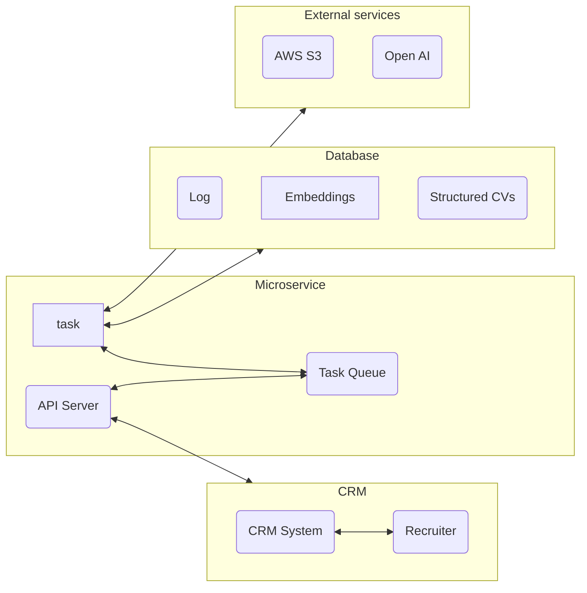

## Общие замечания

* Всегда использовать номер версии в путях REST запросов и в структурах данных.
* Любое взаимодействие с микросервисом должно укладываться в 10 секунд.
* Для сокращения размера данных мы используем 10-и символьный уникальный строковый идентификатор, который представляет собой представленное в кодировке base64 числовое значение. 

## Принципиальная архитектура



#### Замечания по реализации микросервиса

1. Запрос на подбор кандидатов отправляется в микросервис из CRM. С запросом передается ИД базы данных и массив embeddings  кандидатов.
2. ИД базы данных -- это идентификатор базы данных, в которой находятся кандидаты. Возможные значения: `ASTN`, `ANDR`. Параметры подключения к базе данных хранятся в конфигурационном файле микросервиса.
<!---3. Микросервис создает задачу и отправляет ее в очередь задач. В ответ возвращает ИД задачи и статус `PENDING`. ИД задачи используется для проверки состояния задачи и получения результата.
4. Микросервис выполняет задачи из очереди в фоновом режиме, последовательно. Текущая, выполняемая в данный момент задача получает статус `PROCESSING`.
5. После завершения задачи, ее результат и статус сохраняются в очереди задач заданное время, после чего задача удаляется, даже если за ее статусом/результатом никто не обратился. Очередь задач, а соответственно и результаты, хранятся в оперативной памяти микросервиса.
6. Пользователь может проверить состояние задачи, передав ИД задачи в микросервис. В ответ получает статус задачи и, если задача завершена, результат.-->
7. При подборе кандидатов мы получаем исходные данные следующим образом:
    1. В БД существует таблица со структурированной информацией о кандидатах (embeddings от скилов и опыта; а также имя, языки и опыт работы). Эту информацию мы получаем таким путём:
        1. Из БД мы достаём информацию по каждому кандидату
            1. Файл присутствует: если имеется у кандидата файл. Этот файл выкачивается из AWS S3 преобразуется в JSON с помощью GPЕ-3.5 Turbo.
            2. Файл отсутствует: в этом случае информация собирается по таблицам с которыми свяхан кандидат в JSON.
        2. JSON сохраняется в отдельную таблицу
        3. Из образованного JSON берутся формируется 2 embeddings (skills, experience) (с помощью text-embedding-3-large; размером 256) и сохраняются в новый JSON вместе с именем, языками и колличеством опыта). Он сохраняется в отдельную таблицу.
        4. Апдейт делается раз в сутки
    2. Описание вакансии мы принимается на вход
    3. Преобраум описание вакансии в JSON (с помощью GPЕ-4 Turbo).
    4. Берём embedding от описание вакансии JSON (с помощью text-embedding-3-large; размером 256).
8. После получения исходных данных, делаем подбор. Для этого сначала фильтрацией (тип и язык резюме) убираем нерелевантные варианты. Далее используем косинусное сравнение векторов и формируем финальную оценку кандидата.
9. Топ 20 кандидатов храним в массиве (выкачиваются их резюме если имеются; если нет, то формируется файл из json).
10. После завершения задачи, описание вакансии (json?) сохраняется в БД, также сохраняются оуенки рекуртёра.

## API

### POST /api/update_db

Запрос на обновление ДБ. На вход передается объект следующей структуры:

```ts
{
  /** Id of the database. */
  dbId: 'ASTN' | 'ANDR';
}
```

#### HTTP 200

Возвращает объект следующей структуры:

```ts
```

#### HTTP 500

Если неверные данные или запрос невозможно обработать. Дополнительно возвращается объект следующей структуры:

```ts
```

### GET /api/match

Производит подбок кандидатов. На вход передается ИД задачи. запрос возвращает массив кандидатов (top 20).

#### HTTP 200

 возвращается объект следующей структуры:

```ts
{
  /** Result of the task. */
  result: {
    /** Array of objects, each of which contains candidate ID and message. */
    candidate: {
      db: string;
      obj_key: string;
      score: number;
      name: string;
    }[];
  };
}
```

Если задача находится в состоянии `FAILURE`, то возвращается объект следующей структуры:

```ts
```

### POST /api/get_pdf

Возвращает path к файлу кандидата.

#### HTTP 200
```ts
{
  filename: string;
}
```


#### HTTP 500

```ts

```

## Таблицы в базе данных

### Таблицы CRM системы

#### Таблица `candidate`

Список кандидатов. Отсюда CRM система берет ИД кандидатов для генерации поздравлений.

#### Таблицы `candidates_resume_files` и `file`

Если нам надо получить ключ файла резюме, то мы берем его с помощью запроса:

```sql
select 
  * 
from 
  candidates_resume_files rf
  join file f on f.id = rf.file_id
where
  rf.candidate_id = :CandidateId
```


#### Таблицы `candidates_skills`, `skill` и `skill_level`

Информацию о скилах берем из этих таблиц с помощью запроса:

```sql  
select 
  s.name as skill,
  sl.name as level
from
  candidates_skills cs
  join skill s on s.id = cs.skill_id
  join skill_level sl on sl.id = cs.skill_level_id
where
  cs.candidate_id = :CandidateId
```

### Таблица `matching_logs`

Таблица для хранения логов работы микросервиса.

```sql

```

### Таблица `resumes_json`

Таблица для хранения резюме в формате JSON.

```sql

```

### Таблица `resumes_emb`

Таблица для хранения embeddings.

```sql

```

#### Таблица для хранения структурированной информации о кандидате

Таблица для хранения структурированной информации резюме.

Таблица для хранения структурированной информации embeddings.

## Другие вопросы реализации


